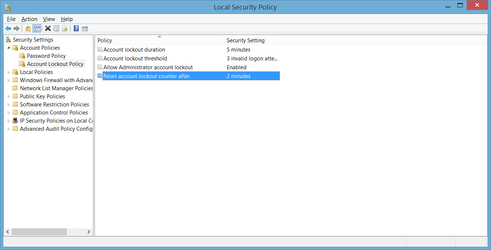
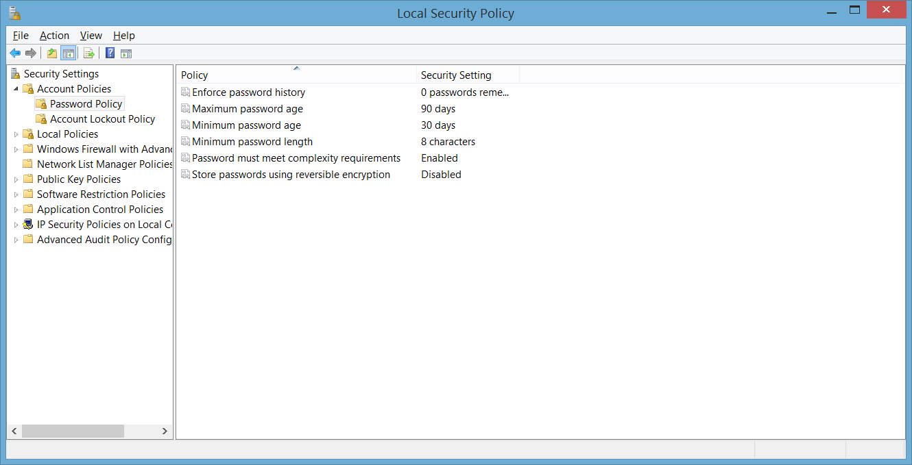
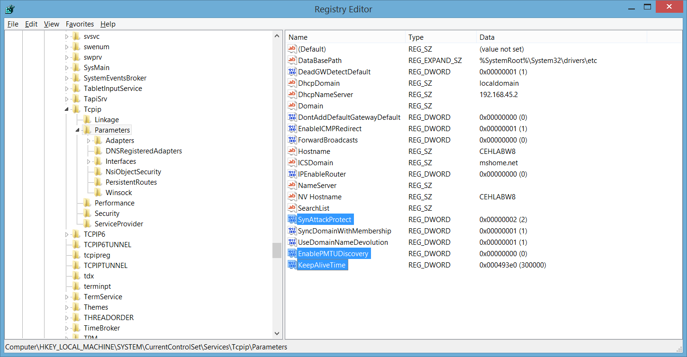
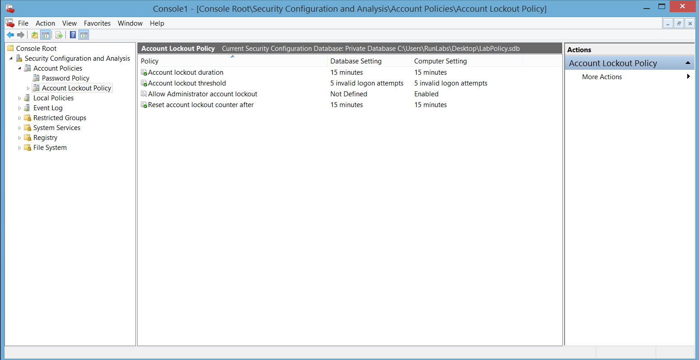
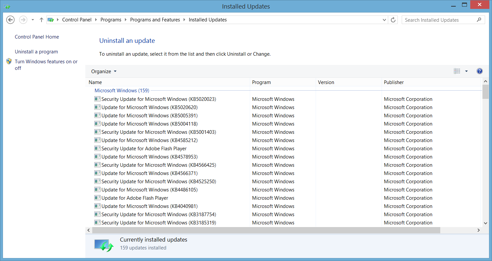

# Lab Practice: Secure Operating System Configuration

## 1. Laboratory Overview & Objectives

The objective of this lab is to configure, harden, and secure a Windows-based operating system using administrative security controls. This involves managing user access and password policies, configuring secure registry settings and TCP/IP stack tweaking to mitigate Denial of Service (DoS) risks, deploying MMC security templates, and hardening browser settings alongside system patch verification.

* **Host System:** Windows 11 or Windows Server Laboratory Machine
* **Target OS:** Windows 8 / XP / Legacy Windows Environment
* **Management Tools:** Microsoft Management Console (MMC), Registry Editor (`regedit`), Local Security Policy, Internet Options

---

## 2. Step-by-Step Task Execution & Evidence

### Task 1: User Accounts and Password Policies

1. Created a new user account with dedicated administrative privileges.
2. Disabled default system accounts (such as Guest) or minimized their permission scope to the lowest access tier.
3. Applied NSA-recommended password complexity and account lockout thresholds using `secpol.msc`.

> **📸 Verification Screenshot 1: Account Lockout & Password Policy Configuration**
> 
> 

### Task 2: Secure Registry Settings

1. Navigated to local registry hives (`HKLM\SYSTEM\CurrentControlSet\Services\LanmanServer\Parameters`) to restrict null session access.
2. Configured policies to restrict anonymous access and disable default administrative shares (`AutoShareWks` / `AutoShareServer`).
3. Enforced restrictions on null session access over named pipes.

> **📸 Verification Screenshot 2: Registry Hardening and Null Session Restrictions**
> 

### Task 3: TCP/IP Stack Tweaking

1. Hardened the Windows network stack via registry keys (`HKLM\SYSTEM\CurrentControlSet\Services\Tcpip\Parameters`) to protect against TCP SYN flood and DoS attacks.
2. Configured parameters such as `SynAttackProtect`, `EnablePMTUDiscovery`, and `KeepAliveTime`.

> **📸 Verification Screenshot 3: TCP/IP Stack DoS Mitigation Parameters**
> 

### Task 4: Installing Security Templates via MMC

1. Launched the Microsoft Management Console by typing `MMC` in the Run prompt.
2. Added the **Security Configuration and Analysis** snap-in via `Console > Add/Remove Snap-in`.
3. Created a new security database, imported a hardened security template, and executed the security analysis.

> **📸 Verification Screenshot 4: MMC Security Configuration and Analysis Snap-in**
> 

### Task 5: Securing Microsoft Internet Explorer

1. Configured Security Zone settings to block all unsigned ActiveX components.
2. Adjusted Privacy settings to restrict cookies exclusively to first-party and session cookies.
3. Disabled active scripting under the Security settings panel.

> **📸 Verification Screenshot 5: Internet Explorer Hardened Security Settings**
> 
> 

### Task 6: Patching Windows

1. Connected to Microsoft Update services to perform a system vulnerability scan.
2. Identified missing security rollups and software patches.
3. Installed updates and documented applied KB patches for audit compliance.

> **📸 Verification Screenshot 6: System Patch Verification and Update Log**
> 

---

## 3. Lab Questions & Technical Analysis

**Question 1: Why is it critical to restrict null session access and default administrative shares on a network host?**

* **Answer:** Null sessions allow unauthenticated users to establish connections to a system without providing a username or password. Attackers can exploit null sessions to enumerate account names, security policies, and share details. Disabling default administrative shares and restricting null session access prevents lateral movement and unauthorized reconnaissance across the local network.

**Question 2: How does adjusting registry settings for TCP/IP stack tweaking help mitigate DoS attacks?**

* **Answer:** Stack tweaking alters how the operating system handles incomplete network handshakes (such as TCP SYN requests). By enabling settings like `SynAttackProtect`, the OS reduces the connection timeout duration and allocates fewer memory resources to unacknowledged half-open connections, preserving system stability during flood attacks.

---

## 4. Laboratory Reflection

All tasks for securing the operating system environment were successfully completed. By systematically enforcing user account controls, applying registry-level network hardening, deploying centralized MMC security templates, and restricting legacy browser attack vectors, the machine's overall attack surface was significantly reduced. The laboratory system is now baseline-hardened according to standard security recommendations.