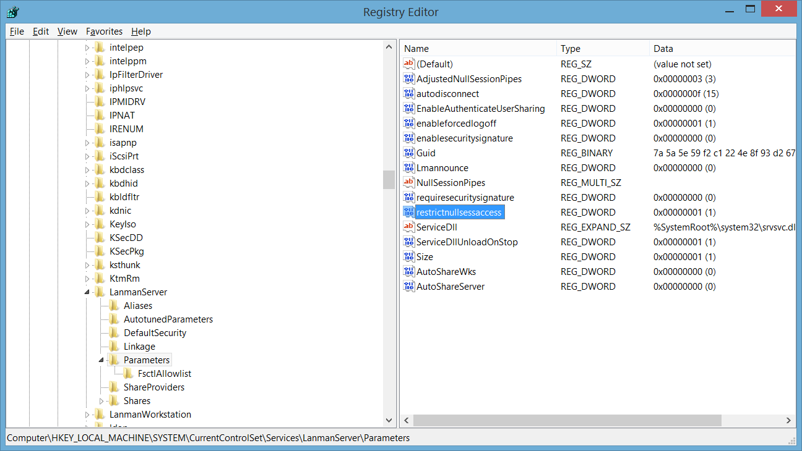

# Lab Practice: Task 2 - Secure Registry Settings

## 1. Task Overview & Objectives

The objective of this section is to configure and verify critical Windows Registry settings on a laboratory machine to harden the operating system against unauthorized local network access. This includes restricting null session access, disabling default administrative shares, limiting anonymous user privileges, and securing named pipes to prevent network enumeration.

* **Target OS:** Windows Laboratory Host
* **Management Tool:** Registry Editor (`regedit.exe`)
* **Key Registry Hive:** `HKLM\SYSTEM\CurrentControlSet\Services\LanmanServer\Parameters`

---

## 2. Step-by-Step Task Execution & Evidence

### Task 2: Secure Registry Settings

1. Opened the Registry Editor (`regedit`) and navigated to the target parameter key: `HKLM\SYSTEM\CurrentControlSet\Services\LanmanServer\Parameters`.
2. Configured DWORD key `RestrictNullSessAccess` to `1` to prevent unauthenticated users from establishing null sessions over the network.
3. Created DWORD keys `AutoShareWks` and `AutoShareServer` and set their values to `0` to disable default hidden administrative shares (`C$`, `ADMIN$`).
4. Enforced restrictions on anonymous access and secured null session communication across named pipes.

> **📸 Verification Screenshot 2: Registry Hardening and Null Session Restrictions**
> 

---

## 3. Technical Analysis & Lab Questions

**Question: Why is restricting null session access and named pipe communication crucial for network security?**

* **Answer:** Null sessions allow unauthenticated remote attackers to establish anonymous connections to a Windows host. Once connected, attackers can enumerate system accounts, security policies, group names, and system shares. Restricting null session access over named pipes closes this attack vector and prevents unauthorized network reconnaissance.