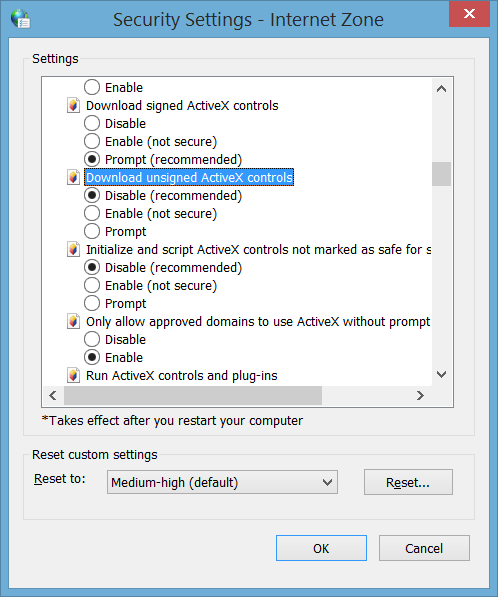
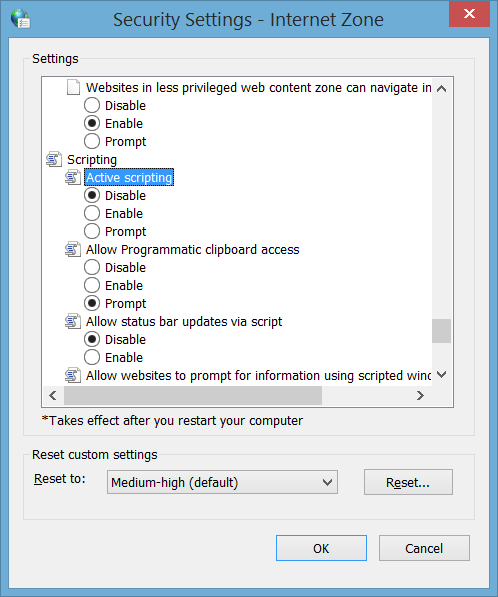

# Lab Practice: Task 5 - Securing Microsoft Internet Explorer

## 1. Task Overview & Objectives

The objective of this task is to configure advanced security, privacy, and scripting controls within Microsoft Internet Explorer to harden the web browser against common client-side attack vectors. By enforcing strict ActiveX execution policies, restricting tracking cookies, and disabling unauthenticated active scripting, the system minimizes exposure to malicious web content and drive-by downloads.

* **Target OS:** Windows Laboratory Host
* **Management Tool:** Internet Options (`inetcpl.cpl`)
* **Focus Areas:** Internet Security Zone Hardening, Privacy Controls, and Scripting Mitigation

---

## 2. Step-by-Step Task Execution & Evidence

### Task 5: Securing Microsoft Internet Explorer

1. Configured Security Zone settings to block all unsigned ActiveX components.
2. Adjusted Privacy settings to restrict cookies exclusively to first-party and session cookies.
3. Disabled active scripting under the Security settings panel.

> **📸 Verification Screenshot 5: Internet Explorer Hardened Security Settings**
> 
> 

---

## 3. Technical Analysis & Lab Questions

**Question: Why is disabling unsigned ActiveX controls and active scripting essential for client-side browser security?**

* **Answer:** Unsigned ActiveX controls lack cryptographic verification of authenticity and integrity, allowing attackers to execute untrusted binary code directly on the host machine. Disabling active scripting alongside unsigned ActiveX components prevents malicious scripts (e.g., Cross-Site Scripting, drive-by downloads, and browser exploitation frameworks) from executing automatically within the context of the user's browser session.

---

